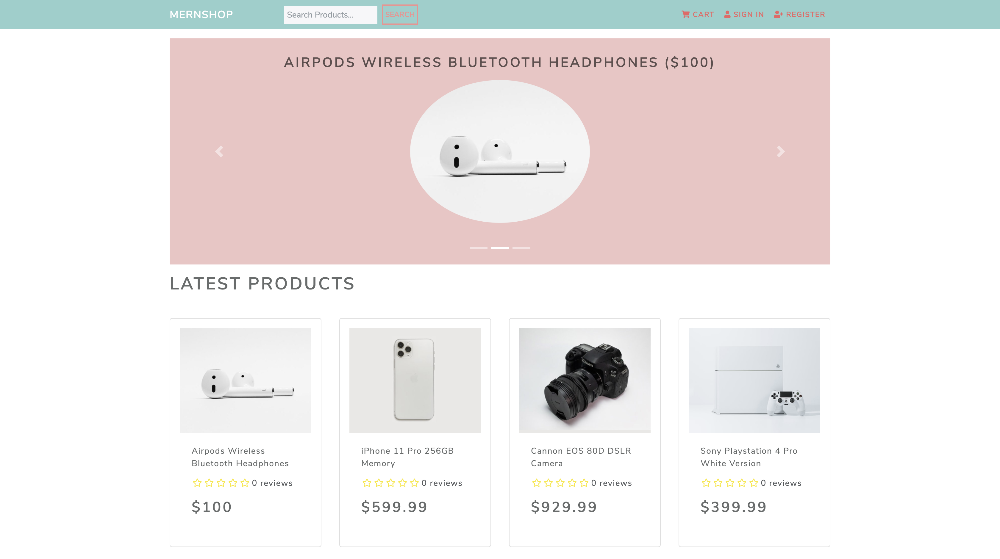
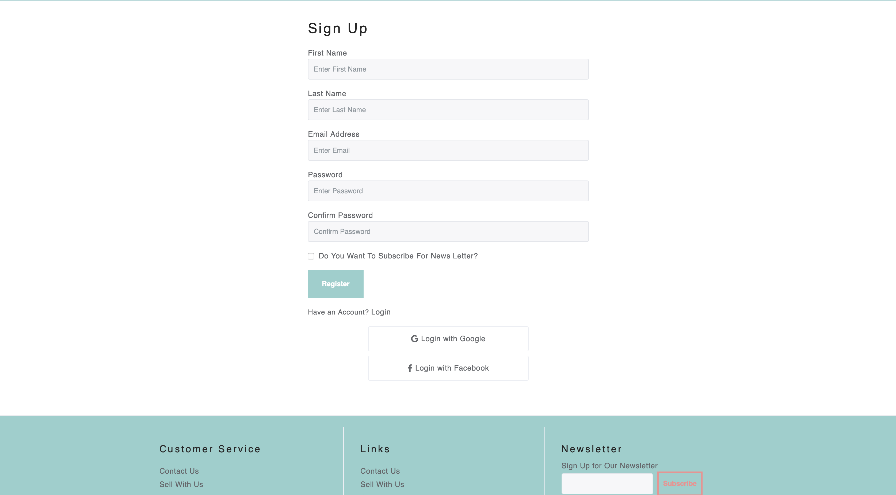

# Mehrn-shop-admin-panel

1. Customers can browse the store categories, products and brands
2. Sellers/Merchants can manage their own brand component
3. Admin(s) can manage and control the entire store components 

## Languages & tools

- [Node](https://nodejs.org/en/)

Node provides the backend environment for this application

- [Express](https://expressjs.com/)

Express middleware is used to handle requests, routes

- [Mongoose](https://mongoosejs.com/)

Mongoose schemas to model the application data

- [React](https://reactjs.org/)

1. React for displaying UI components
2. Redux to manage application's state
3. Redux Thunk middleware to handle asynchronous redux actions

## Steps to install and run 
1. install
"npm run install"
2. make a .env file in the root directory 
NODE_ENV, BASE_SERVER_URL, BASE_API_URL, BASE_CLIENT_URL, PORT, MONGO_URI,
JWT_SECRET, JWT_TOKENLIFE,
PAYPAL_CLIENT_ID, MAILCHIMP_KEY, MAILCHIMP_LIST_KEY,
MAILGUN_KEY, MAILGUN_DOMAIN, MAILGUN_EMAIL_SENDER,
GOOGLE_CLIENT_ID, GOOGLE_CLIENT_SECRET, GOOGLE_CALLBACK_URL,
FACEBOOK_CLIENT_ID, FACEBOOK_CLIENT_SECRET, FACEBOOK_CALLBACK_URL,

3. To run
"npm  run dev"
